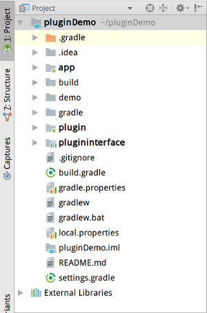
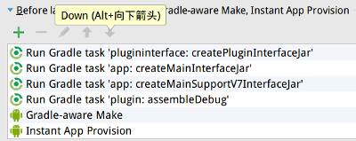

# 插件化fragment加载演示
本demo演示了如何加载以插件apk方式存在的fragment，完成了:
- 用尽可能少的代码实现插件fragment的代码和资源的加载
- 提供了编译工程所需的中间jar包的生成方式

## 演示
- 白色背景部分是主工程activity
- 蓝色背景部分是插件fragment
- 白色的主工程activity中加载了蓝色的插件fragment

## 如何运行
1. 通过Android Studio的package manager安装23.0.2版本的build-tools，和android 25 platform
2. 项目使用的gradle版本是3.5，android gradle plugin版本是2.2.0，如果没装的话可以提前下载
3. 在项目的build-tools/23.0.2目录中的三个平台的aapt中，选择合适自己平台的aapt，覆盖自己android sdk目录中build-tools/23.0.2下的aapt，记得备份原有的aapt:

4. 打开项目，执行gradle sync以下载必要的依赖，完成后的工程结构:

5. 每次运行前，请按顺序执行以下gradle task:

　　

或者直接把这几个task设置到AS的run configuration里：

6. 运行：

## 实现目标
- 主工程能加载了插件apk中的fragment
- 主工程能调用插件中的代码
- 插件能调用自己和主工程的代码
- 主工程和插件能找到各自的资源
- 主工程能通过固定的资源id找到插件的资源
- 插件能通过固定的资源id找到主工程的资源
- 主工程和插件的资源能出现在同一个activity中
- 主工程和插件能使用共同的supportV7包和配套主题

## 原理
### 工程
